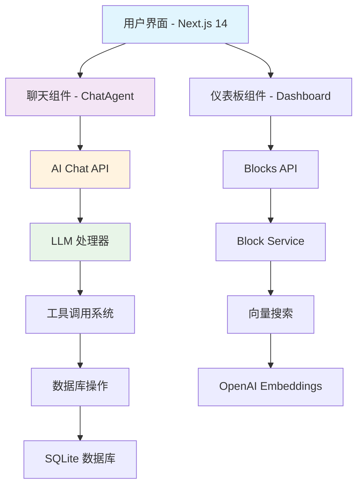
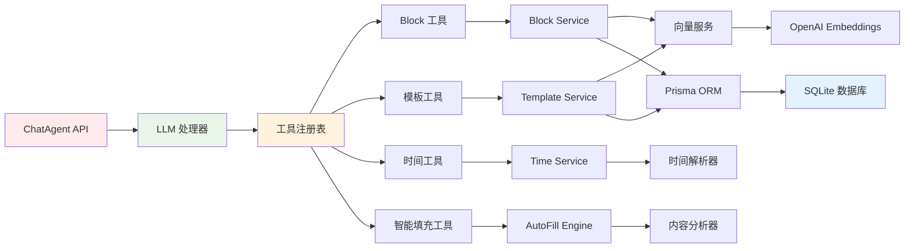

# LifeControl 文档中心

[](https://github.com/lifecontrol)
[](./system-architecture.md)
[](./system-architecture.md)

## 📖 概述

LifeControl 是一个 **AI Agent 中心化** 的人生管理系统。用户通过自然语言对话完成所有操作，AI 自动创建和管理页面、组织内容、安排时间。摒弃了传统的复杂界面，实现了真正的"对话即操作"。

## 🏗️ 系统架构

### 前端架构


### 后端架构


## 📚 文档导航

### 核心文档
- **[系统架构](./system-architecture.md)** - AI Agent 中心化架构设计
- **[AI Agent 核心理念](./ai-agent-centered-philosophy.md)** - 设计哲学和用户体验
- **[项目结构](./project-structure.md)** - 代码结构和模块说明

## 🚀 快速开始

### 1. 环境准备
```bash
# 克隆项目
git clone <repository-url>
cd LifeControl

# 安装依赖
npm install

# 配置环境变量
cp .env.example .env
# 编辑 .env 文件，设置 OPENAI_API_KEY
```

### 2. 数据库初始化
```bash
# 生成 Prisma 客户端
npx prisma generate

# 初始化数据库和默认模板
npm run init-db
```

### 3. 启动开发服务器
```bash
npm run dev
```

访问 [http://localhost:3000](http://localhost:3000) 开始使用。

## 🔧 核心技术栈

### 前端技术
- **Next.js 14** - React 应用框架，使用 App Router
- **TypeScript** - 类型安全的 JavaScript
- **Tailwind CSS** - 样式框架
- **Radix UI** - 组件库
- **BlockNote** - 富文本编辑器

### 后端技术
- **Prisma ORM** - 数据库操作
- **SQLite** - 开发数据库
- **OpenAI API** - LLM 和向量嵌入
- **Vercel AI SDK** - AI 工具调用框架

### AI 架构
- **Tool Calling** - 结构化的 AI 工具调用
- **LLM Integration** - OpenAI GPT-4 集成
- **RAG System** - 基于向量的检索增强生成
- **Semantic Search** - 语义搜索和内容匹配

## 📊 系统特性

### ✨ 核心功能
- **🤖 AI Agent 中心化** - 所有操作通过自然语言对话完成
- **📄 Page as Block** - AI 动态创建和管理页面，无需预定义结构
- **🧩 统一 Block 系统** - 文本、表格、待办、标题、提醒、页面都是 Block
- **🔍 语义搜索** - 基于内容含义的智能搜索和关联
- **⏰ 智能时间管理** - 自然语言时间解析和任务调度
- **🎯 零学习成本** - 无需学习界面，直接对话即可使用

### 🛠️ 技术特性
- **响应式设计** - 支持桌面和移动设备
- **实时数据** - 即时的内容更新和同步
- **类型安全** - 全栈 TypeScript 支持
- **可扩展架构** - 模块化的工具和服务设计
- **向量存储** - 高效的语义搜索和内容匹配

## 🎯 使用场景

### AI 驱动的人生管理
- **对话创建** - "帮我创建一个健身计划页面"，AI 自动生成完整页面
- **智能组织** - AI 自动将信息填充到合适的位置和页面
- **动态调整** - 根据用户反馈，AI 主动建议优化和简化
- **全息分析** - AI 基于所有信息提供深度洞察和建议

### 零学习成本的体验
- **自然交互** - 像与朋友聊天一样管理人生
- **无界面学习** - 不需要记住按钮位置和功能
- **即时反馈** - AI 立即理解并执行用户意图
- **持续优化** - 系统主动识别并解决复杂度问题

## 📈 项目状态

### ✅ 已完成功能
- [x] AI Agent 中心化架构
- [x] Page as Block 系统
- [x] 统一 Block 渲染系统
- [x] 动态页面路由 (/p/[id])
- [x] 自然语言对话界面
- [x] Tool+LLM+RAG 技术栈
- [x] 向量搜索和语义匹配
- [x] 智能内容组织和填充

### 🚧 进行中
- [ ] 完善工具系统和 AI 集成
- [ ] 优化用户体验和响应速度
- [ ] 添加更多 Block 类型

### 📋 未来扩展
- [ ] 多用户支持和协作
- [ ] 移动端适配
- [ ] 第三方工具集成
- [ ] 高级 AI 分析功能
- [ ] 情绪管理和压力检测

## 🤝 贡献指南

1. **Fork 项目**
2. **创建功能分支** (`git checkout -b feature/AmazingFeature`)
3. **提交更改** (`git commit -m 'Add some AmazingFeature'`)
4. **推送到分支** (`git push origin feature/AmazingFeature`)
5. **打开 Pull Request**

## 📄 许可证

本项目采用 MIT 许可证 - 查看 [LICENSE](../LICENSE) 文件了解详情。

## 📞 联系我们

- **项目主页**: [GitHub Repository](https://github.com/lifeagent)
- **问题反馈**: [Issues](https://github.com/lifeagent/issues)
- **讨论区**: [Discussions](https://github.com/lifeagent/discussions)

---

*构建更智能的人生管理体验 🚀*